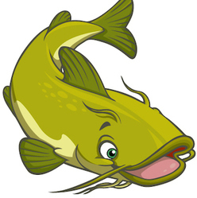

# Tagfish 



Tagfish is a CLI tool to interact with Docker registries. 

Features include:

- List all the tags of a given Docker repository
- Return the most recent explicit tag of a repository
- Update a file with the newest tags
- Search for a repository
- Authenticate by reading native Docker config file 
- Works against hub.docker.com and private registries
- Supports Docker Registry/Distribution API v1 and v2 

To use Tagfish against a registry requiring authentication, you first need to authenticate to the given registry using `docker login <REGISTRY>`.

## Table of contents

<!-- MarkdownTOC autolink=true bracket=round depth=4 -->

- [Usage](#usage)
  - [`tagfish tags`](#tagfish-tags)
    - [Example](#example)
  - [`tagfish search`](#tagfish-search)
    - [Example](#example-1)
  - [`tagfish update`](#tagfish-update)
    - [Example](#example-2)
    - [Official repositories](#official-repositories)
- [Installation](#installation)
  - [Gem](#gem)
    - [Limitations](#limitations)
  - [Docker image](#docker-image)
- [Contributing](#contributing)
- [Licence](#licence)


<!-- /MarkdownTOC -->

## Usage
The Tagfish CLI tool has different subcommands for interacting with Docker registries.

### `tagfish tags`
The `tags` subcommands is used to retrieve tags from a given repository:

    Usage:
        tagfish tags [OPTIONS] REPOSITORY

    Parameters:
        REPOSITORY                    docker repository

    Options:
        -l, --latest                  only return latest explicitly tagged image
        -s, --short                   only return tag, not full image path
        -h, --help                    print help

Where `repository` is a docker repository path, including the docker registry. The tags are returned in alphabetical order.

The `--latest` option gets the image ID of the docker image tagged `latest` in the repository, finds a matching image with a tag set manually (e.g: date, version number), and returns that tag. This option will not work if there is no image tagged `latest` in your repository.

#### Example
```
$ tagfish tags alpine
alpine:2.6
alpine:2.7
alpine:3.1
alpine:3.2
alpine:edge
alpine:latest
```

### `tagfish search`
The `search` command is used to search for a repository in a given registry.

    Usage:
        tagfish search [OPTIONS] [KEYWORD]

    Parameters:
        [KEYWORD]                     object to search

    Options:
        -r, --registry REGISTRY       Docker registry (default: "index.docker.io")
        -h, --help                    print help

Note: `search` will not work if the search API is disabled on the registry side. 

#### Example
```
$ tagfish search alpine
alpine
1science/alpine
webhippie/alpine
anapsix/alpine-java
colstrom/alpine
appelgriebsch/alpine
[...]
```

### `tagfish update`
The `update` subcommand is used to update a file with the latest tags available:

    Usage:
        tagfish update [OPTIONS] FILE
    
    Parameters:
        FILE                          file to update
    
    Options:
        -d, --dry-run                 enable dry run
        --only PATTERN                Only update repositories matching pattern. Wildcards `*` may be used.
        -h, --help                    print help

#### Example
```
$ tagfish update --dry-run Dockerfile
-FROM docker-registry.delivery.realestate.com.au/gpde/ubuntu-ruby2.2:201508191500
+FROM docker-registry.delivery.realestate.com.au/gpde/ubuntu-ruby2.2:201511261833
```

#### Official repositories
`tagfish update` will update repositories such as:
```
private.registry/namespace/repository:tag
namespace/repository:tag
```
However, it will not update the tag of official repositories, such as:
```
ubuntu:tag
```
This is because updating to a new OS automatically might be something you want to avoid, and because it is hard to match a repository without a namespace.

## Installation
### Gem
Tagfish is packaged as a Ruby gem. Install it from the command line:

```
$ gem install tagfish
```

#### Limitations
Tagfish requires Ruby 2.2 or newer if the registry you are accessing restricts TLS to v1.2.

### Docker image
Tagfish is released as a Docker image as well, and can be run with:

```
docker run --rm \
  -v ~/.docker/config.json:/root/.docker/config.json:ro \
  -v ${PWD}:/cwd \
  cowbell/tagfish
```

## Contributing

Bug reports and pull requests are welcome on GitHub at https://github.com/realestate-com-au/tagfish .

## Licence

Copyright (c) 2015 REA Group Ltd.

Permission is hereby granted, free of charge, to any person obtaining a copy
of this software and associated documentation files (the "Software"), to deal
in the Software without restriction, including without limitation the rights
to use, copy, modify, merge, publish, distribute, sublicense, and/or sell
copies of the Software, and to permit persons to whom the Software is
furnished to do so, subject to the following conditions:

The above copyright notice and this permission notice shall be included in
all copies or substantial portions of the Software.

THE SOFTWARE IS PROVIDED "AS IS", WITHOUT WARRANTY OF ANY KIND, EXPRESS OR
IMPLIED, INCLUDING BUT NOT LIMITED TO THE WARRANTIES OF MERCHANTABILITY,
FITNESS FOR A PARTICULAR PURPOSE AND NONINFRINGEMENT. IN NO EVENT SHALL THE
AUTHORS OR COPYRIGHT HOLDERS BE LIABLE FOR ANY CLAIM, DAMAGES OR OTHER
LIABILITY, WHETHER IN AN ACTION OF CONTRACT, TORT OR OTHERWISE, ARISING FROM,
OUT OF OR IN CONNECTION WITH THE SOFTWARE OR THE USE OR OTHER DEALINGS IN
THE SOFTWARE.
